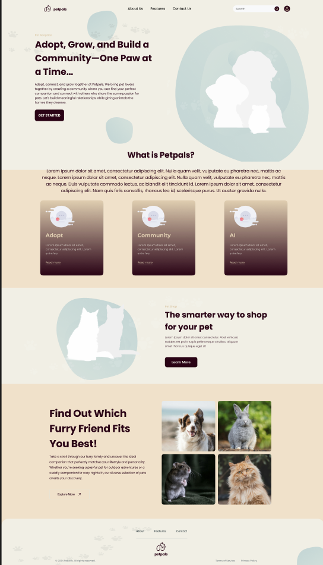

# PetPals

## Table of Contents

1. [Overview](#Overview)
2. [Product Specification](#product-specification)
3. [Wireframe](#wireframe)
4. [Sprints](#sprints)
5. [Authors](#Authors)

## Overview

### Description
A web application that allows users to discover the joy of pet adoption alongside a supportive community of animal lovers. PetPals is a space where you can not only fiind you perfect pet match, but also share experiences, advice and love with other pet owners. Let's male adoption the start of a new journey together!

## Product Specification

### Features
- **Pet Matching**: Find your perfect pet based on your preferences.
- **Community Support**: Share experiences, advice, and love with other pet owners.
- **Adoption Resources**: Access resources and information to help you through the adoption process.

### Technologies Used
- **Frontend**: NextJS, Tailwind, TypeScript
- **Backend**: Node.js, ExpressJS
- **Database**: MongoDB
- **Authentication**: Clerk Authentication

## Wireframe

## Sprints
- **Sprint 1**: Initial setup, basic UI design, and user authentication.
- **Sprint 2**: Implement pet matching algorithm and community features.
- **Sprint 3**: Finalize adoption resources and polish UI/UX.

## Authors
- @birongliu 
- @shuyi320 
- @jjessica415
- @bradleyhung